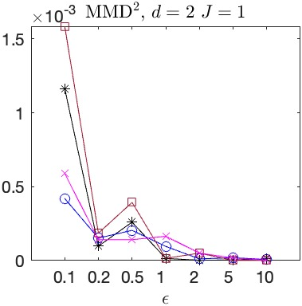
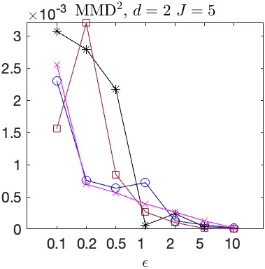
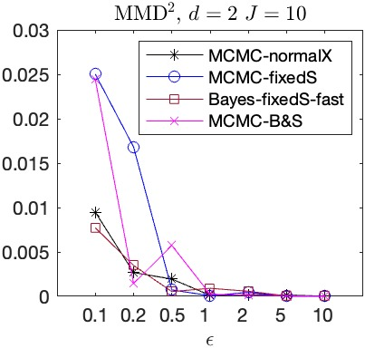
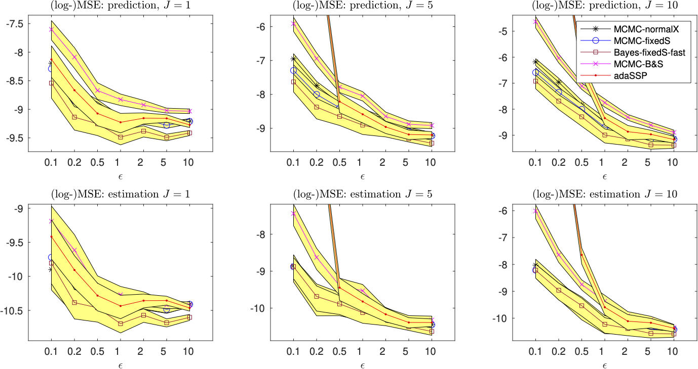
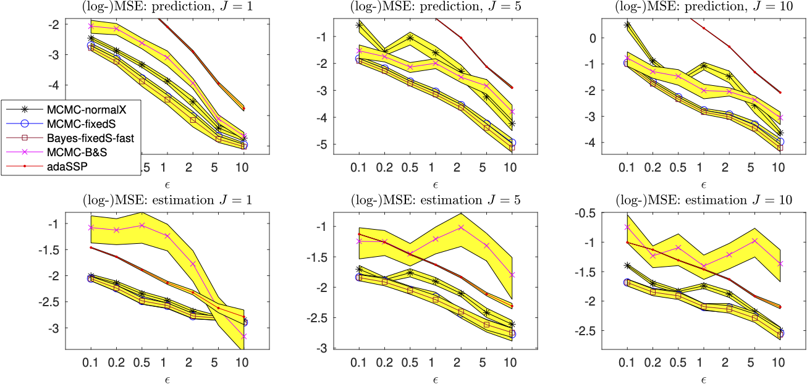

# DP_dist_BayesLR

**MMD results**

J=1                        |  J=5                      |  J=10
:-------------------------:|:-------------------------:|:-------------------------:
  |   |

----------------------------------------------------------------------

**90% CI for mean prediction and estimation performances (computed using 50 runs), n = 10^5, d = 2**

---------------------------------------------------------------------

**90% CI for mean prediction and estimation performances (computed using 50 runs), n = 10^5, d = 5**

